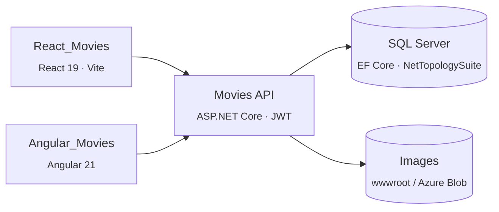

🇪🇸 [Español](README.md)&nbsp;|&nbsp;🇬🇧 English

# 🎬 Movies API — ASP.NET Core Web API

REST API built with **ASP.NET Core (.NET 10)** and **Entity Framework Core** to manage a movie catalog: genres, actors, cinemas with geographic location, movies, and user ratings. It is the backend for two client applications that consume it:

- [React_Movies](https://github.com/iliana212/React_Movies) — React 19 + TypeScript
- [Angular_Movies](https://github.com/iliana212/Angular_Movies) — Angular 21

   

*Route, class and entity names (`generos`, `peliculas`, `cines`, `esadmin`…) are kept as-is from the actual codebase — they are Spanish for genres, movies, cinemas and "is admin".*

> **Status:** actively in development.

  

## At a glance

- 6 resources (genres, actors, cinemas, movies, ratings and users) exposed through REST controllers, **DTOs** and **AutoMapper**
- **JWT** authentication with ASP.NET Core Identity and claim-based authorization (`esadmin`)
- **Geospatial data** with NetTopologySuite for cinema locations
- Image uploads (movie posters and actor photos) with **local** or **Azure Blob Storage**, swappable through an interface
- Movie filtering, pagination, tag-based **output caching**, and **Swagger / OpenAPI** documentation

## Architecture



## Main endpoints

| Resource | Routes | Access |
| --- | --- | --- |
| Genres | `api/generos` (CRUD) · `GET api/generos/todos` | Admin (`todos` is public) |
| Actors | `api/actores` (CRUD) · `GET api/actores/{nombre}` (search by name) | Admin |
| Cinemas | `api/cines` (CRUD) | Admin |
| Movies (read) | `GET api/peliculas/landing` · `GET api/peliculas/{id}` · `GET api/peliculas/filtrar` | Public |
| Movies (management) | `POST` / `PUT` / `DELETE api/peliculas` · `GET PostGet` · `GET PutGet/{id}` | Admin |
| Ratings | `POST api/rating` | Authenticated user |
| Users | `POST api/usuarios/registrar` · `POST api/usuarios/login` | Public |
| User administration | `GET ListadoUsuarios` · `POST HacerAdmin` · `POST RemoverAdmin` | Admin |

- **Landing:** movies currently in theaters and upcoming releases.
- **Details:** include the average rating and the authenticated user's own vote.
- **Filter:** by title, genre, in theaters, and upcoming releases, with pagination (maximum 50 records per page).
- The total record count is returned in the `cantidad-total-registros` response header.

## Tech stack

| Area | Technology |
| --- | --- |
| Framework | ASP.NET Core Web API, .NET 10 |
| Data access | Entity Framework Core 10, SQL Server, code-first migrations |
| Spatial data | NetTopologySuite (SRID 4326) |
| Security | ASP.NET Core Identity, JWT Bearer |
| Mapping | AutoMapper |
| Storage | Local file system / Azure Blob Storage |
| Docs | Swashbuckle (Swagger UI) |

## Project structure

```
├── Controllers/      # API endpoints
├── DTOs/             # Data transfer objects
├── Entidades/        # EF Core entities
├── Migrations/       # Database migrations
├── Servicios/        # Services (users, file storage)
├── Utilidades/       # AutoMapper profiles, cache policy, extensions
├── Validaciones/     # Custom validation attributes
├── wwwroot/          # Static files / uploaded images
├── ApplicationDBContext.cs
└── Program.cs        # Service registration and HTTP pipeline
```

## Getting started

### Prerequisites

- [.NET 10 SDK](https://dotnet.microsoft.com/download)
- SQL Server (LocalDB, Express, Docker, or a full instance)
- EF Core CLI: `dotnet tool install --global dotnet-ef`

### 1. Clone the repository

```bash
git clone https://github.com/iliana212/API_Movies.git
cd API_Movies
```

### 2. Configure secrets

`appsettings.json` intentionally contains no connection strings or keys. Set them with [user secrets](https://learn.microsoft.com/aspnet/core/security/app-secrets) (or an `appsettings.Development.json` that is **not** committed):

```bash
dotnet user-secrets init
dotnet user-secrets set "ConnectionStrings:DefaultConnection" "Server=(localdb)\\MSSQLLocalDB;Database=PeliculasDB;Trusted_Connection=True;TrustServerCertificate=True"
dotnet user-secrets set "Jwt:Issuer" "https://localhost"
dotnet user-secrets set "Jwt:Audience" "https://localhost"
dotnet user-secrets set "Jwt:llavejwt" "<a-long-random-string-of-at-least-32-characters>"
dotnet user-secrets set "origenesPermitidos" "http://localhost:5173,http://localhost:4200"
```

| Key | Purpose |
| --- | --- |
| `ConnectionStrings:DefaultConnection` | SQL Server connection string |
| `Jwt:Issuer` / `Jwt:Audience` | Expected issuer and audience of the tokens |
| `Jwt:llavejwt` | Symmetric key used to sign JWT tokens |
| `origenesPermitidos` | Comma-separated origins allowed by CORS (React on `5173`, Angular on `4200` by default) |
| `ConnectionStrings:AzureStorageConnection` | Only if you use Azure Blob Storage |

### 3. Create the database

```bash
dotnet ef database update
```

### 4. Run the API

```bash
dotnet run --launch-profile https
```

Swagger UI will be available at `https://localhost:7263/swagger`.

### 5. Create the first administrator

Management endpoints require the `esadmin` claim, and only an administrator can grant it. For the very first user:

1. Register it with `POST api/usuarios/registrar` from Swagger.
2. Add the claim directly in the database:

```sql
INSERT INTO AspNetUserClaims (UserId, ClaimType, ClaimValue)
SELECT Id, 'esadmin', 'true' FROM AspNetUsers WHERE Email = 'your-email@example.com';
```

From then on, that administrator can promote other users through `POST api/usuarios/HacerAdmin`.

### Authenticating in Swagger

Sign in with `POST api/usuarios/login`, copy the token, click **Authorize**, and paste it.

### Switching file storage to Azure Blob Storage

Images are saved under `wwwroot` by default. To use Azure, change the `IAlmacenadorArchivos` registration in `Program.cs` from `AlmacenadorArchivosLocal` to `AlmacenadorArchivosAzure` and add the `ConnectionStrings:AzureStorageConnection` setting.

## Related projects

| Project | Description |
| --- | --- |
| [React_Movies](https://github.com/iliana212/React_Movies) | React + TypeScript client |
| [Angular_Movies](https://github.com/iliana212/Angular_Movies) | Angular client |

## Author

**Iliana Barron** — [@iliana212](https://github.com/iliana212)
