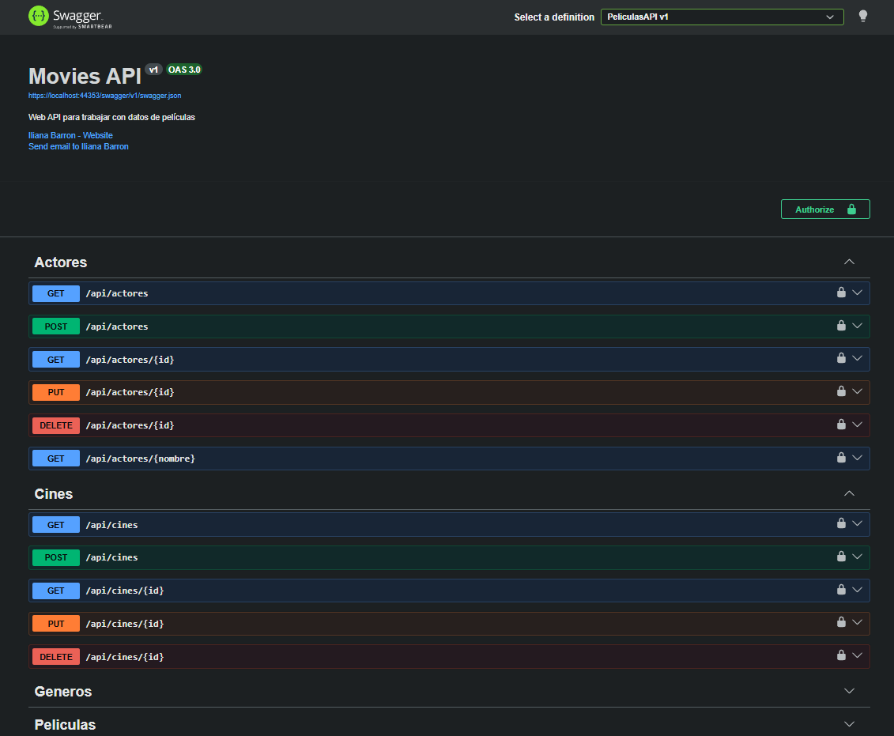
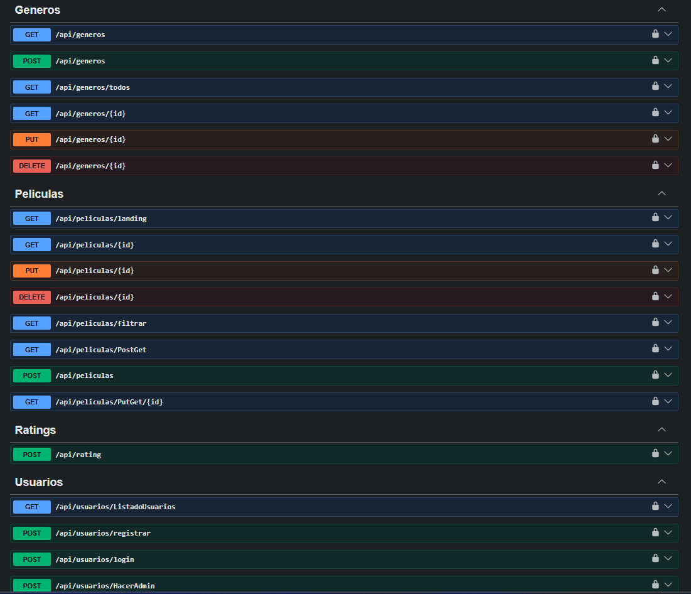
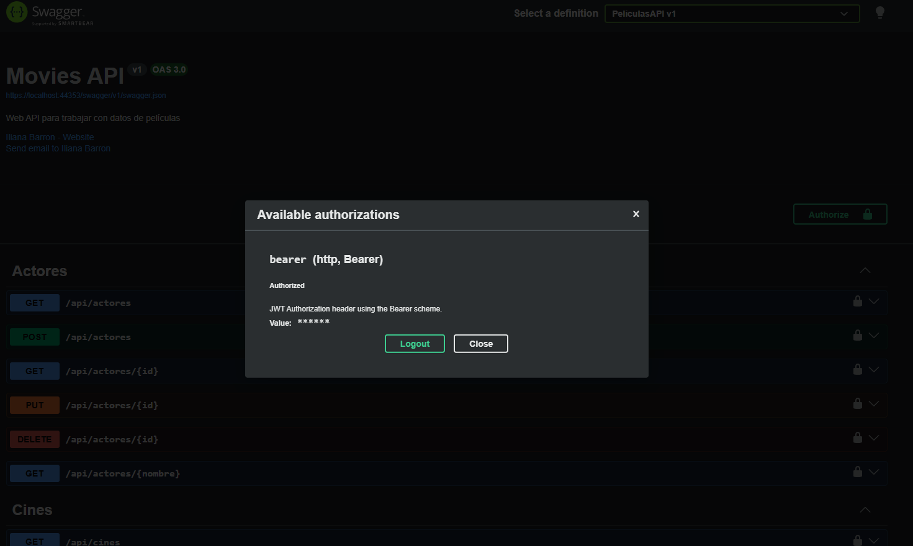
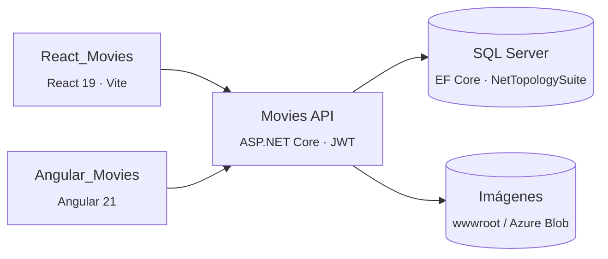

🇪🇸 Español&nbsp;|&nbsp;🇬🇧 [English](README.en.md)

# 🎬 Movies API — Web API en ASP.NET Core

API REST construida con **ASP.NET Core (.NET 10)** y **Entity Framework Core** para administrar un catálogo de películas: géneros, actores, cines con ubicación geográfica, películas y calificaciones de usuarios. Es el backend de dos clientes que la consumen:

- [React_Movies](https://github.com/iliana212/React_Movies) — React 19 + TypeScript
- [Angular_Movies](https://github.com/iliana212/Angular_Movies) — Angular 21

   

> **Estado:** en desarrollo activo.

  

## En un vistazo

- 6 recursos (géneros, actores, cines, películas, calificaciones y usuarios) expuestos con controladores REST, **DTOs** y **AutoMapper**
- Autenticación **JWT** con ASP.NET Core Identity y autorización basada en claims (`esadmin`)
- **Datos geoespaciales** con NetTopologySuite para la ubicación de los cines
- Carga de imágenes (posters de películas y fotos de actores) con almacenamiento **local** o **Azure Blob Storage**, intercambiable mediante una interfaz
- Filtrado de películas, paginación, **caché de salida** con tags y documentación **Swagger / OpenAPI**

## Arquitectura



## Endpoints principales

| Recurso | Rutas | Acceso |
| --- | --- | --- |
| Géneros | `api/generos` (CRUD) · `GET api/generos/todos` | Admin (`todos` es público) |
| Actores | `api/actores` (CRUD) · `GET api/actores/{nombre}` (búsqueda por nombre) | Admin |
| Cines | `api/cines` (CRUD) | Admin |
| Películas (lectura) | `GET api/peliculas/landing` · `GET api/peliculas/{id}` · `GET api/peliculas/filtrar` | Público |
| Películas (gestión) | `POST` / `PUT` / `DELETE api/peliculas` · `GET PostGet` · `GET PutGet/{id}` | Admin |
| Calificaciones | `POST api/rating` | Usuario autenticado |
| Usuarios | `POST api/usuarios/registrar` · `POST api/usuarios/login` | Público |
| Administración de usuarios | `GET ListadoUsuarios` · `POST HacerAdmin` · `POST RemoverAdmin` | Admin |

- **Landing:** películas en cines y próximos estrenos.
- **Detalle:** incluye el promedio de calificaciones y el voto del usuario autenticado.
- **Filtro:** por título, género, en cines y próximos estrenos, con paginación (máximo 50 registros por página).
- El total de registros se devuelve en el encabezado `cantidad-total-registros`.

## Tecnologías

| Área | Tecnología |
| --- | --- |
| Framework | ASP.NET Core Web API, .NET 10 |
| Acceso a datos | Entity Framework Core 10, SQL Server, migraciones code-first |
| Datos espaciales | NetTopologySuite (SRID 4326) |
| Seguridad | ASP.NET Core Identity, JWT Bearer |
| Mapeo | AutoMapper |
| Almacenamiento | Sistema de archivos local / Azure Blob Storage |
| Documentación | Swashbuckle (Swagger UI) |

## Estructura del proyecto

```
├── Controllers/      # Endpoints de la API
├── DTOs/             # Objetos de transferencia de datos
├── Entidades/        # Entidades de EF Core
├── Migrations/       # Migraciones de base de datos
├── Servicios/        # Servicios (usuarios, almacenamiento de archivos)
├── Utilidades/       # Perfiles de AutoMapper, política de caché, extensiones
├── Validaciones/     # Atributos de validación personalizados
├── wwwroot/          # Archivos estáticos / imágenes subidas
├── ApplicationDBContext.cs
└── Program.cs        # Registro de servicios y pipeline HTTP
```

## Cómo ejecutarlo

### Requisitos

- [.NET 10 SDK](https://dotnet.microsoft.com/download)
- SQL Server (LocalDB, Express, Docker o una instancia completa)
- EF Core CLI: `dotnet tool install --global dotnet-ef`

### 1. Clonar el repositorio

```bash
git clone https://github.com/iliana212/API_Movies.git
cd API_Movies
```

### 2. Configurar los secretos

`appsettings.json` no contiene cadenas de conexión ni llaves. Configúralas con [user secrets](https://learn.microsoft.com/aspnet/core/security/app-secrets) (o con un `appsettings.Development.json` que **no** se suba al repositorio):

```bash
dotnet user-secrets init
dotnet user-secrets set "ConnectionStrings:DefaultConnection" "Server=(localdb)\\MSSQLLocalDB;Database=PeliculasDB;Trusted_Connection=True;TrustServerCertificate=True"
dotnet user-secrets set "Jwt:Issuer" "https://localhost"
dotnet user-secrets set "Jwt:Audience" "https://localhost"
dotnet user-secrets set "Jwt:llavejwt" "<una-cadena-aleatoria-de-al-menos-32-caracteres>"
dotnet user-secrets set "origenesPermitidos" "http://localhost:5173,http://localhost:4200"
```

| Clave | Para qué sirve |
| --- | --- |
| `ConnectionStrings:DefaultConnection` | Cadena de conexión a SQL Server |
| `Jwt:Issuer` / `Jwt:Audience` | Emisor y audiencia esperados de los tokens |
| `Jwt:llavejwt` | Llave simétrica para firmar los tokens JWT |
| `origenesPermitidos` | Orígenes permitidos por CORS, separados por coma (React en `5173`, Angular en `4200` por defecto) |
| `ConnectionStrings:AzureStorageConnection` | Solo si usas Azure Blob Storage |

### 3. Crear la base de datos

```bash
dotnet ef database update
```

### 4. Ejecutar la API

```bash
dotnet run --launch-profile https
```

Swagger UI queda disponible en `https://localhost:7263/swagger`.

### 5. Crear el primer administrador

Los endpoints de gestión requieren el claim `esadmin`, y solo un administrador puede otorgarlo. Para el primer usuario:

1. Regístralo con `POST api/usuarios/registrar` desde Swagger.
2. Asígnale el claim directamente en la base de datos:

```sql
INSERT INTO AspNetUserClaims (UserId, ClaimType, ClaimValue)
SELECT Id, 'esadmin', 'true' FROM AspNetUsers WHERE Email = 'tu-correo@ejemplo.com';
```

A partir de ahí, ese administrador puede promover a otros usuarios con `POST api/usuarios/HacerAdmin`.

### Autenticación en Swagger

Inicia sesión con `POST api/usuarios/login`, copia el token, haz clic en **Authorize** y pégalo.

### Cambiar el almacenamiento a Azure Blob Storage

Por defecto las imágenes se guardan en `wwwroot`. Para usar Azure, cambia en `Program.cs` el registro de `IAlmacenadorArchivos` de `AlmacenadorArchivosLocal` a `AlmacenadorArchivosAzure` y agrega la cadena `ConnectionStrings:AzureStorageConnection`.

## Proyectos relacionados

| Proyecto | Descripción |
| --- | --- |
| [React_Movies](https://github.com/iliana212/React_Movies) | Cliente en React + TypeScript |
| [Angular_Movies](https://github.com/iliana212/Angular_Movies) | Cliente en Angular |

## Autora

**Iliana Barron** — [@iliana212](https://github.com/iliana212)
